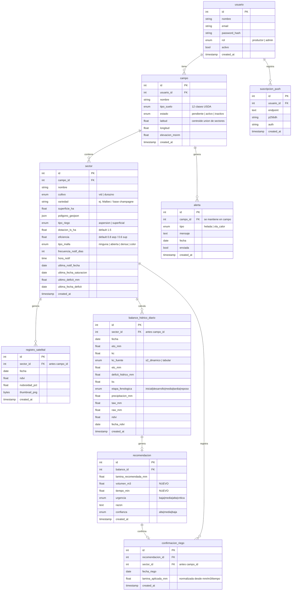

# Diseño Sprint 2 — Sectores y recomendación operativa

Documento de diseño (target) para el Sprint 2. Se valida antes de programar; al terminar,
se reconcilian `docs/modelo-datos/er-diagram.md` y `docs/arquitectura/arquitectura.md`.

Fuentes de requerimientos:
- `docs/entrevistas/entrevista-finca-morgan-2026-05.md`
- `docs/historias-usuario/sprint-2.md`

---

## 1. Decisiones cerradas

- **Datos:** prod y dev solo tienen datos de prueba → **rediseño limpio del esquema** (drop & recreate, sin migración de datos).
- **`sector`:** nueva entidad; `campo` pasa a ser contenedor.
- **`cultivo` → `sector`** (cada sector puede ser vid o durazno; la variedad va con el cultivo).
- **`tipo_suelo` y `alerta` → quedan en `campo`.**
- **Recomendación:** se **persisten** `volumen_m3` y `tiempo_min` (inmutables, snapshot al generar).
- **Notificaciones:** hora + frecuencia por sector; **cálculo desacoplado de la notificación**; se registra siempre, se notifica solo si `lámina > 0`.
- **Malla:** `tipo_malla` por sector (`ninguna|abierta|densa|color`) → regla de confianza del Kc.
- **Riego:** `aspersion|superficial`. **Goteo NO** se implementa ahora, pero la conversión se diseña como **estrategia enchufable** por `tipo_riego`.
- **Lat/lon del campo:** derivada del **centroide de la unión de los polígonos de sus sectores**.

---

## 2. Modelo de datos objetivo (ER)



### Resumen de cambios
- **NUEVO `sector`** entre `campo` y todo lo que se calcula.
- **Movido de `campo` → `sector`:** `cultivo`, `superficie_ha`, `poligono_geojson`, malla, y el estado de balance (`ultima_fecha_saturacion`, `ultimo_deficit_mm`, `ultima_fecha_deficit`).
- **Nuevo en `sector`:** `variedad`, `tipo_riego`, `dotacion_ls_ha`, `eficiencia`, `tipo_malla`, `frecuencia_notif_dias`, `hora_notif`, `ultima_notif_fecha`.
- **FK `campo_id` → `sector_id`:** `registro_satelital`, `balance_hidrico_diario`, `confirmacion_riego`.
- **Nuevo en `recomendacion`:** `volumen_m3`, `tiempo_min`.
- **Sin cambios:** `usuario`, `suscripcion_push`. **Queda en `campo`:** `tipo_suelo`, `alerta`, lat/lon/elevación.

---

## 3. Flujo de alta de campo + sectores

1. El productor crea el campo y **dibuja uno o más sectores** (cada uno: polígono, cultivo, variedad, tipo_riego, dotación, eficiencia, malla, prefs de notificación).
2. Se calcula el **centroide de la unión** de los polígonos (`shapely.unary_union(...).centroid`) → `campo.latitud/longitud`.
3. Con ese punto se consultan **SoilGrids** (`campo.tipo_suelo`) y la **elevación** (`campo.elevacion_msnm`).
4. El admin aprueba el campo (`estado = activo`) → se dispara el **backfill del balance por cada sector**.

Reglas:
- Un campo tiene **≥ 1 sector**.
- Los polígonos de los sectores deben quedar dentro/coherentes con el campo (validación geométrica).

---

## 4. Conversión lámina ↔ m³ ↔ tiempo

Implementada como **estrategia por `tipo_riego`** (función que calcula la tasa de aplicación según el método), para que **goteo** enchufe a futuro sin refactor.

**Superficial / aspersión** (tasa derivada de la dotación; el área se cancela):
```
volumen_m3 = lamina_mm × superficie_ha × 10
tiempo_min = (10000 × lamina_mm / dotacion_ls_ha / eficiencia) / 60
```
**Inversa (confirmación de riego ingresada en tiempo o volumen → mm):**
```
lamina_mm (desde tiempo) = tiempo_min × 60 × dotacion_ls_ha × eficiencia / 10000
lamina_mm (desde volumen) = volumen_m3 / (superficie_ha × 10)
```

Defaults de eficiencia: **aspersión 0,8** · **superficial 0,6** (ajustables por sector).
`volumen_m3` y `tiempo_min` se **persisten** en `recomendacion` al generarse (inmutables).

> Detalle y fuentes en `docs/referencias/referencias.md` → "Conversión de lámina de riego a tiempo".
> **Goteo (futuro):** la tasa NO sale de la dotación/ha sino de los emisores (caudal por gotero × densidad), y FAO-56 agrega un factor de fracción mojada al balance. Queda como HU futura.

---

## 5. Regla de confianza del Kc (malla por sector)

| Situación del sector | kc_fuente | confianza |
|---|---|---|
| S2 nítida, **sin malla** (`ninguna`) | s2_dinamico | alta |
| S2 nítida, **malla `abierta`** | s2_dinamico | media |
| **malla `densa` o `color`** | tabular | media |
| Sin imagen reciente (nublado) | tabular | media |

Respaldo empírico y bibliográfico (solo malla) en
`docs/entrevistas/entrevista-finca-morgan-2026-05.md`. La corrección/offset para malla
abierta queda como mejora futura (spike HU-S2-05: validación emparejada misma variedad).

---

## 6. Arquitectura de jobs — cálculo desacoplado de notificación

### A) Job de cálculo (madrugada, batcheado y escalonado)
Lo pesado; **no** atado a la hora del productor.
- **Clima: 1 llamada Open-Meteo por `campo`** (lat/lon del campo), reutilizada por todos sus sectores.
- **NDVI cacheado:** `registro_satelital` es el cache; se consulta GEE solo si la última imagen del sector es vieja (~> 5 días).
- Por sector: calcula balance + recomendación (incluye `volumen_m3`, `tiempo_min`) y **persiste siempre** (aún en reposo o lámina 0).
- **Concurrencia limitada** en llamadas externas (no disparar todas a la vez).

### B) Job de notificación (cada ~15–30 min, liviano)
- Toma sectores cuyo `hora_notif` cae en la ventana actual y cuya frecuencia se cumplió
  (`hoy − ultima_notif_fecha ≥ frecuencia_notif_dias`).
- Si la recomendación del día tiene **`lámina > 0` → envía push** y setea `ultima_notif_fecha = hoy`.
- Si es 0 → no envía (la recomendación ya quedó registrada). `ultima_notif_fecha` solo se actualiza al enviar.
- A cada tick: `SELECT` + push → barato aunque muchos usuarios compartan horario.

### C) Job de alertas climáticas (cada 6h)
Sin cambios de fondo (helada / ola de calor se envían siempre; nivel `campo`).

> Escalabilidad: el costo real está en las APIs externas, no en CPU. Clima por campo + NDVI cacheado + concurrencia limitada + notificación liviana por ventana horaria.

---

## 7. Cambios por módulo

- **`app/models`:** nueva tabla/modelo `Sector`; repunte de FKs; campos nuevos; `recomendacion.volumen_m3/tiempo_min`.
- **Alembic:** rediseño limpio (drop & recreate; sin migración de datos).
- **`app/ingestion`:** clima por campo (1 llamada reutilizada); satélite por polígono de sector con cache (refetch solo si imagen vieja).
- **`app/calculation`:** balance/Kc por sector; cultivo/fenología por sector; nueva conversión lámina↔m³↔tiempo (estrategia por `tipo_riego`).
- **`app/decision`:** regla de confianza de Kc según `tipo_malla`.
- **`app/services`:** `field`/`sector` (alta, centroide, soil/elevación), `recommendation` por sector.
- **`app/jobs`:** separar job de cálculo (madrugada, batch) del job de notificación (ventana horaria por sector); criterio "notificar solo si lámina > 0".
- **`app/api`:** endpoints por sector (CRUD sector, recomendación, confirmación, prefs notif); confirmación acepta mm/m³/tiempo.
- **Frontend:** alta multi-sector (varios polígonos + datos por sector); recomendación/historial/confirmar riego por sector; pantalla de preferencias de notificación.

---

## 8. Tareas futuras (fuera de alcance del Sprint 2)
- **Riego por goteo:** agregar a `tipo_riego` + estrategia de conversión por emisores + factor de fracción mojada (FAO-56). HU propia.
- **Estación meteorológica local (COVIAR / Pegasus, est. Las Paredes):** evaluar si tiene API para usarla como fuente operativa local; mientras tanto, candidata a **referencia de validación** del ETo. Ver `docs/arquitectura/arquitectura.md` → validación académica.
- **Corrección/offset de NDVI bajo malla abierta** (spike HU-S2-05).

---

## 9. Plan de implementación (orden)
1. **HU-S2-01 (13)** — `sector` + repunte de FKs + cálculo por sector (cimiento).
2. **HU-S2-03 (5)** — conversión mm/m³/tiempo + `tipo_riego` + persistir.
3. **HU-S2-05 (5)** — malla por sector + regla de Kc.
4. **HU-S2-04 (8)** — jobs desacoplados + prefs de notificación.
5. **HU-S2-06 (3)** — calibración (bloqueada por el historial de Morgan).

Al finalizar: reconciliar `er-diagram.md` y `arquitectura.md` (y corregir el drift previo: entidad `suelo`/`productor` inexistentes, jobs viejos).
