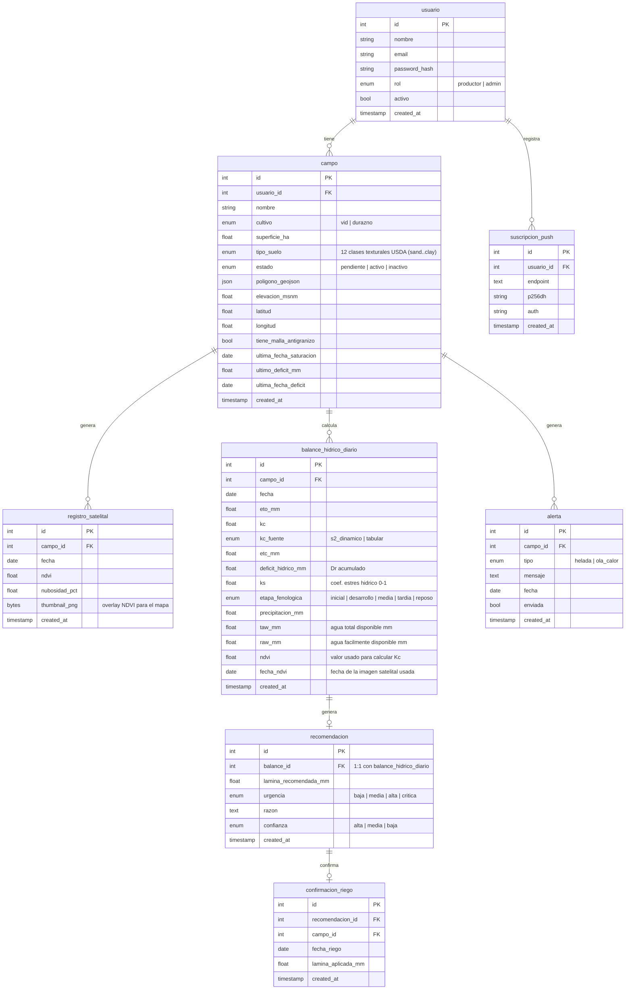

# Modelo de datos — irrigation-advisor

## Diagrama Entidad-Relación

---

## Decisiones de diseño

### Lo que va en la base de datos
- Parámetros de suelo (FC, WP) se derivan del `tipo_suelo` del campo usando la tabla de Saxton & Rawls (2006) para las 12 clases texturales USDA.
- El `ultimo_deficit_mm` y `ultima_fecha_deficit` del campo permiten el backfill retroactivo del balance hídrico ante días sin recomendación guardada.
- `registro_satelital` guarda los registros de NDVI extraídos de Sentinel-2 (vía Google Earth Engine) para cada campo y fecha, junto con el thumbnail PNG que la PWA muestra como overlay sobre el mapa.
- `balance_hidrico_diario` guarda el estado hídrico de cada día (ETo, Kc, Dr, Ks, etapa); `recomendacion` se relaciona 1:1 y guarda solo la salida para el productor (lámina, urgencia, razón, confianza).
- `ndvi` y `fecha_ndvi` en `balance_hidrico_diario` registran qué imagen satelital se usó para calcular el Kc de ese día.

### Lo que NO va en la base de datos (configuración estática en código)
- Kc por etapa fenológica para cada cultivo
- Duración de cada etapa fenológica por cultivo
- Profundidad de raíces (Zr) por etapa por cultivo
- Fracción de depleción permisible (p) por cultivo
- Valores FC/WP por tipo de suelo (Saxton & Rawls 2006)
- Umbrales de alerta climática (temperatura de helada, etc.)

### Flujo de confianza de Kc
| Situación | kc_fuente | confianza |
|---|---|---|
| Sentinel-2 disponible, nubosidad baja | s2_dinamico | alta |
| Imagen disponible pero campo con malla antigranizo | tabular | media |
| Sin imagen óptica reciente (nublado) | tabular | media |
