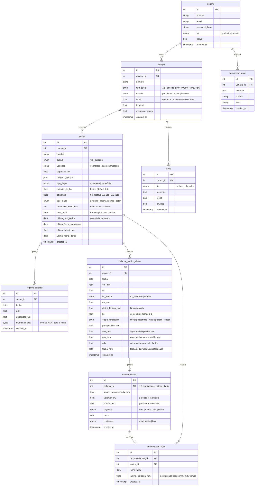

# Modelo de datos — irrigation-advisor

> Modelo objetivo del Sprint 2 (introducción de `sector`). El detalle de diseño, jobs y
> plan de implementación está en `docs/diseno/sprint-2-sectores.md`.

## Diagrama Entidad-Relación

---

## Decisiones de diseño

### Jerarquía campo → sector
- `campo` es el **contenedor** (un dueño, una ubicación para el clima, un tipo de suelo).
- `sector` es la unidad de cálculo: cada sector tiene su **variedad**, **polígono**, **tipo de riego** y se le calcula NDVI, balance y recomendación de forma independiente.
- Un campo tiene **≥ 1 sector**.
- `latitud`/`longitud` del campo se derivan del **centroide de la unión de los polígonos de sus sectores**; con ese punto se consultan SoilGrids (tipo de suelo) y la elevación.

### Lo que va en la base de datos
- Parámetros de suelo (FC, WP) se derivan del `tipo_suelo` del **campo** usando la tabla de Saxton & Rawls (2006) para las 12 clases texturales USDA.
- El `ultimo_deficit_mm` y `ultima_fecha_deficit` del **sector** permiten el backfill retroactivo del balance hídrico ante días sin recomendación guardada.
- `registro_satelital` guarda los registros de NDVI (Sentinel-2 vía GEE) por **sector** y fecha, con el thumbnail PNG que la PWA muestra como overlay; funciona además como **cache** de NDVI.
- `balance_hidrico_diario` guarda el estado hídrico de cada día por sector; `recomendacion` se relaciona 1:1 y guarda la salida para el productor (lámina mm, **volumen m³**, **tiempo min**, urgencia, razón, confianza).
- `volumen_m3` y `tiempo_min` se persisten al generar la recomendación (inmutables); fórmulas en `docs/referencias/referencias.md`.

### Lo que NO va en la base de datos (configuración estática en código)
- Kc por etapa fenológica, duración de etapas, profundidad de raíces (Zr) y fracción de depleción (p) por cultivo.
- Valores FC/WP por tipo de suelo (Saxton & Rawls 2006).
- Umbrales de alerta climática (temperatura de helada, etc.).

### Flujo de confianza de Kc (según malla del sector)
| Situación del sector | kc_fuente | confianza |
|---|---|---|
| Sentinel-2 nítida, sin malla (`ninguna`) | s2_dinamico | alta |
| Sentinel-2 nítida, malla `abierta` | s2_dinamico | media |
| Malla `densa` o `color` | tabular | media |
| Sin imagen óptica reciente (nublado) | tabular | media |
