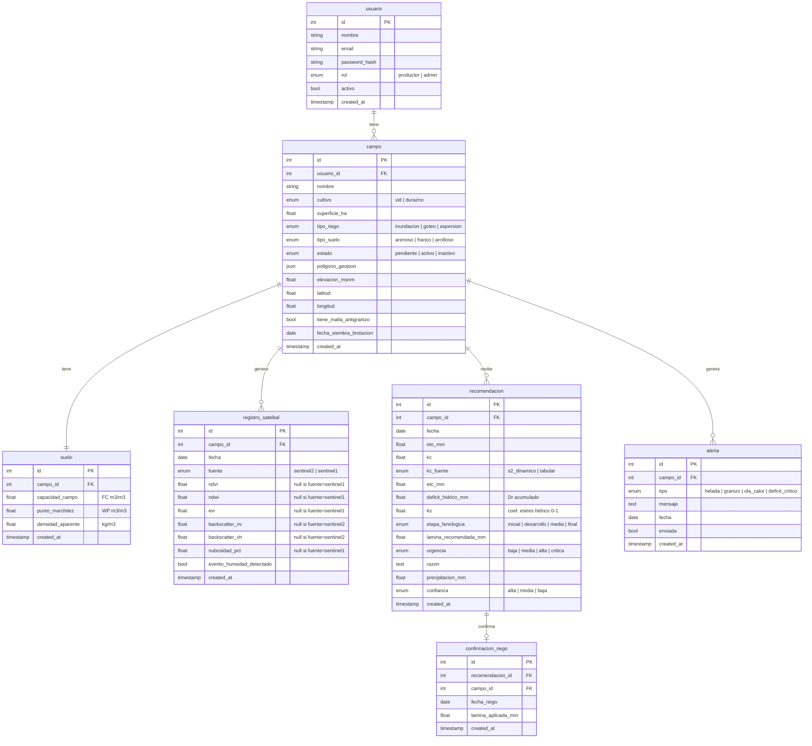

# Modelo de datos — irrigation-advisor

## Diagrama Entidad-Relación

---

## Decisiones de diseño

### Lo que va en la base de datos
- Parámetros de suelo (FC, WP, densidad) se derivan del `tipo_suelo` del campo usando tablas FAO estáticas al momento de activar el campo. Se guardan en `suelo` para no recalcular.
- El `deficit_hidrico_mm` de la última `recomendacion` es el punto de partida del balance del día siguiente.
- `registro_satelital` unifica datos de Sentinel-2 (NDVI/NDWI/EVI) y Sentinel-1 (backscatter + detección de humedad) en una sola tabla.

### Lo que NO va en la base de datos (configuración estática en YAML)
- Kc por etapa fenológica para cada cultivo
- Duración de cada etapa fenológica por cultivo
- Profundidad de raíces (Zr) por etapa por cultivo
- Fracción de depleción permisible (p) por cultivo
- Valores FC/WP/densidad por tipo de suelo
- Umbrales de alerta climática (temperatura de helada, etc.)

### Flujo de confianza de Kc
| Situación | kc_fuente | confianza |
|---|---|---|
| Sentinel-2 disponible, nubosidad baja, sin malla | s2_dinamico | alta |
| Sentinel-2 muy nublada | tabular | media |
| Campo con malla antigranizo | tabular | media |
