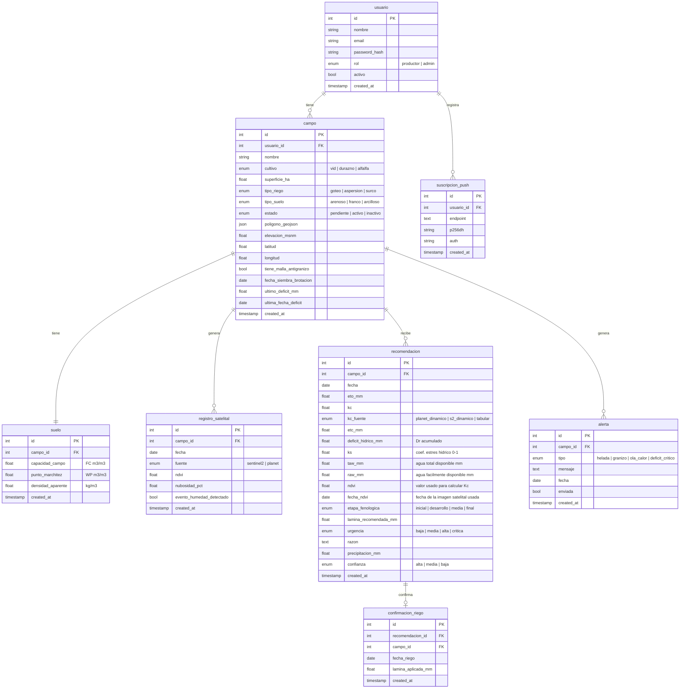

# Modelo de datos — irrigation-advisor

## Diagrama Entidad-Relación

---

## Decisiones de diseño

### Lo que va en la base de datos
- Parámetros de suelo (FC, WP, densidad) se derivan del `tipo_suelo` del campo usando tablas FAO estáticas al momento de activar el campo. Se guardan en `suelo` para no recalcular.
- El `ultimo_deficit_mm` y `ultima_fecha_deficit` del campo permiten el backfill retroactivo del balance hídrico ante días sin recomendación guardada.
- `registro_satelital` unifica registros de distintas fuentes satelitales (Planet Labs y Sentinel-2) en una sola tabla, identificadas por el campo `fuente`.
- `ndvi` y `fecha_ndvi` en `recomendacion` registran qué imagen satelital se usó para calcular el Kc de ese día.

### Lo que NO va en la base de datos (configuración estática en código)
- Kc por etapa fenológica para cada cultivo
- Duración de cada etapa fenológica por cultivo
- Profundidad de raíces (Zr) por etapa por cultivo
- Fracción de depleción permisible (p) por cultivo
- Valores FC/WP/densidad por tipo de suelo
- Umbrales de alerta climática (temperatura de helada, etc.)

### Flujo de confianza de Kc
| Situación | kc_fuente | confianza |
|---|---|---|
| Planet Labs disponible, nubosidad baja | planet_dinamico | alta |
| Sin imagen Planet, Sentinel-2 disponible, nubosidad baja | s2_dinamico | alta |
| Imagen disponible pero campo con malla antigranizo | tabular | media |
| Sin imagen de ninguna fuente satelital | tabular | media |
